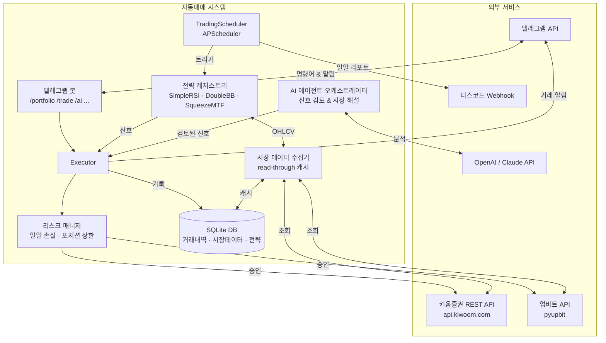
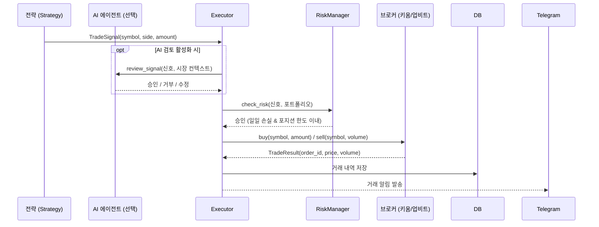

# 자동매매 시스템

국내 주식(키움증권 REST API)과 암호화폐(업비트)를 지원하는 자동매매 시스템입니다. AI 에이전트 레이어를 통해 매매 신호 검토 및 시장 분석을 수행합니다.

> **English README**: [README.md](README.md)

---

## 주요 기능

- **멀티 브로커**: 키움증권 REST API (KRX 국내주식) + 업비트 (암호화폐)
- **3가지 내장 전략**: SimpleRSI, Double Bollinger Band Short, Squeeze MTF
- **AI 에이전트**: OpenAI / Claude 백엔드 기반 신호 검토 및 시장 해설
- **리스크 관리**: 일일 손실 한도, 포지션 크기 상한
- **알림**: 텔레그램 봇 (명령어 & 실시간 알림) + 디스코드 일일 리포트
- **백테스트**: 전략별 내장 백테스트 엔진
- **Docker 기반**: `docker compose up` 한 줄로 실행

---

## 아키텍처

### 시스템 전체 구조



### 매매 실행 흐름



### 디렉토리 구조

```
src/
├── agents/          # AI 에이전트 (OpenAI/Claude 백엔드, 오케스트레이터, 샌드박스)
├── brokers/         # BrokerAdapter 구현체 (키움, 업비트)
├── data/            # 시장 데이터 수집기 (SQLite read-through 캐시)
├── db/              # SQLite 스키마 & 레포지토리
├── engine/          # Executor, RiskManager, Scheduler, Backtest
├── reporters/       # 디스코드 리포터, 텔레그램 노티파이어
├── strategies/      # 전략 베이스 클래스 + 3개 내장 전략
├── telegram/        # 봇 + 명령어 핸들러
└── utils/           # 기술적 지표 (RSI, BB, Squeeze, ...)
```

---

## 내장 전략

| 전략 | 브로커 | 주기 | 신호 로직 |
|------|--------|------|----------|
| **SimpleRSI** | 업비트 | 5분 | RSI < 30 → 매수, RSI > 70 → 매도 |
| **DoubleBBShort** | 업비트 | 15분 | 외측 BB(2σ) 이탈 + RSI 과매도 → 반등 진입 |
| **SqueezeMTF** | 업비트 | 5분 | BB가 KC 안에서 압축(squeeze on) → 폭발 + 멀티타임프레임 확인 후 진입 |

---

## 빠른 시작

### 사전 요구사항

- Python 3.12+
- Docker & Docker Compose
- 각 서비스 API 자격증명 (아래 [설정](#설정) 참조)

### Docker로 실행 (권장)

```bash
cp .env.example .env
# .env 파일에 자격증명 입력
docker compose up -d
docker compose logs -f
```

### 로컬 실행

```bash
python -m venv .venv && source .venv/bin/activate
pip install -e ".[dev]"
cp .env.example .env
# .env 입력 후
python -m src.main
```

---

## 설정

`.env.example`을 `.env`로 복사한 뒤 값을 채워넣습니다:

```env
# 업비트 (암호화폐)
UPBIT_ACCESS_KEY=
UPBIT_SECRET_KEY=

# 키움증권 REST API
KIWOOM_APP_KEY=
KIWOOM_APP_SECRET=
KIWOOM_ACCOUNT_NO=
KIWOOM_IS_PAPER=true        # true = 모의투자, false = 실전

# 텔레그램
TELEGRAM_BOT_TOKEN=
TELEGRAM_CHAT_ID=

# 디스코드 (선택 — 일일 리포트)
DISCORD_WEBHOOK_URL=

# AI 에이전트 (선택 — 하나 이상)
ANTHROPIC_API_KEY=
OPENAI_API_KEY=

# 데이터베이스
DB_PATH=data/trading.db
```

### 자격증명 발급 방법

| 서비스 | 발급 방법 |
|--------|----------|
| **업비트** | [업비트 Open API](https://upbit.com/service_center/open_api_guide) → API 키 생성 |
| **키움증권** | [키움 REST API 포털](https://apiportal.kiwoom.com) → 앱 등록 → AppKey / SecretKey 발급 |
| **텔레그램 봇** | [@BotFather](https://t.me/BotFather) → `/newbot` → 토큰 획득; Chat ID는 `@userinfobot`으로 확인 |
| **디스코드** | 서버 설정 → 연동 → 웹훅 → 새 웹훅 생성 |
| **Anthropic** | [console.anthropic.com](https://console.anthropic.com) → API Keys |
| **OpenAI** | [platform.openai.com](https://platform.openai.com) → API Keys |

> **보안 주의사항**: `.env` 파일은 절대 Git에 커밋하지 마세요. `.gitignore`에 포함되어 있습니다.  
> 프로덕션 환경에서는 Docker secrets, GitHub Actions secrets 등 시크릿 매니저를 사용하세요.

---

## 키움증권 REST API

이 프로젝트는 구 OpenAPI+(HTS 연동)가 아닌 **키움증권 신 REST API** (`api.kiwoom.com`)를 사용합니다.

| 항목 | 값 |
|------|-----|
| 프로덕션 URL | `https://api.kiwoom.com` |
| 모의투자 URL | `https://mockapi.kiwoom.com` (KRX 전용) |
| 인증 방식 | OAuth2 client credentials (토큰 24시간 자동 갱신) |
| 요청 방식 | 모든 요청 HTTP POST + JSON body |
| 모의투자 설정 | `KIWOOM_IS_PAPER=true` |

---

## CI/CD

`.github/workflows/docker-publish.yml`에 정의된 GitHub Actions 워크플로우가 `main` 브랜치 push 시 자동으로 Docker 이미지를 빌드하여 GitHub Container Registry에 푸시합니다:

```
ghcr.io/bongho/trading-system-public:main
ghcr.io/bongho/trading-system-public:sha-<커밋해시>
```

이미지 직접 사용:

```bash
docker pull ghcr.io/bongho/trading-system-public:main

# docker-compose.yml에서 image 사용 시
services:
  trading-engine:
    image: ghcr.io/bongho/trading-system-public:main
    env_file: .env
    volumes:
      - ./data:/app/data
```

---

## 테스트

```bash
pytest -v
pytest --cov=src --cov-report=term-missing
```

---

## 라이선스

MIT
