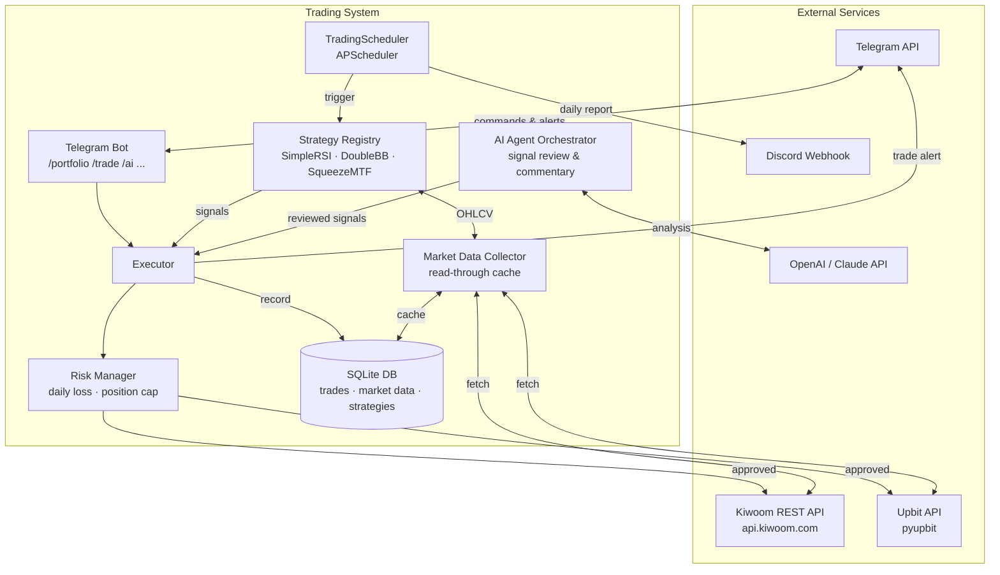
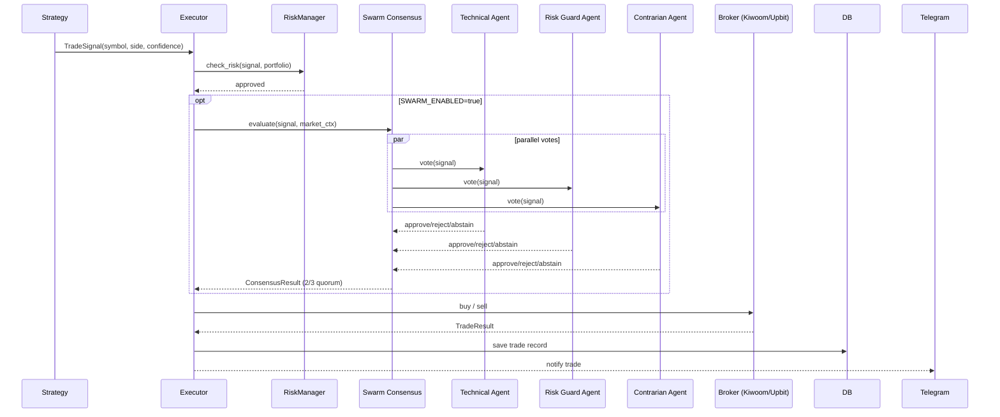
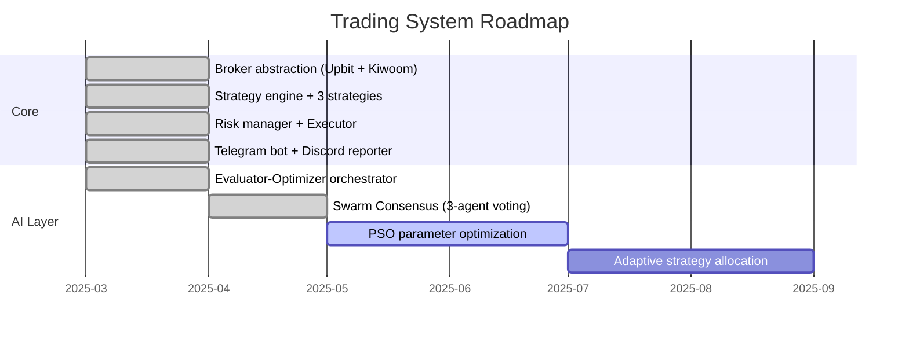

# Trading System

An automated trading system for Korean markets (KRX stocks via Kiwoom Securities, crypto via Upbit) with an AI agent layer for strategy analysis and signal review.

> **Korean README**: [README.ko.md](README.ko.md)

---

## Features

- **Multi-broker**: Kiwoom Securities REST API (KRX stocks) + Upbit (crypto)
- **3 built-in strategies**: SimpleRSI, Double Bollinger Band Short, Squeeze MTF
- **AI agent**: OpenAI / Claude backend for signal review and market commentary
- **Risk management**: Daily loss limit, per-position size cap
- **Notifications**: Telegram bot (command & alert) + Discord daily report
- **Backtesting**: Built-in engine per strategy
- **Docker-first**: Single `docker compose up` to run

---

## Architecture

### System Overview



### Trade Execution Flow (with Swarm Consensus)



### Directory layout

```
src/
├── agents/          # AI agent (OpenAI / Claude backends, orchestrator, sandbox)
├── brokers/         # BrokerAdapter implementations (Kiwoom, Upbit)
├── data/            # Market data collector with SQLite read-through cache
├── db/              # SQLite schema & repositories
├── engine/          # Executor, RiskManager, Scheduler, Backtest
├── reporters/       # Discord reporter, Telegram notifier
├── strategies/      # Strategy base class + 3 built-in strategies
├── telegram/        # Bot + command handlers
└── utils/           # Technical indicators (RSI, BB, Squeeze, ...)
```

---

## Strategies

| Strategy | Broker | Interval | Signal logic |
|----------|--------|----------|--------------|
| **SimpleRSI** | Upbit | 5m | RSI < 30 → buy, RSI > 70 → sell |
| **DoubleBBShort** | Upbit | 15m | Price breaks outer BB (2σ) + RSI oversold → reversal entry |
| **SqueezeMTF** | Upbit | 5m | BB inside KC (squeeze on) → momentum explodes → MTF-confirmed entry |

---

## Quick Start

### Prerequisites

- Python 3.12+
- Docker & Docker Compose
- API credentials (see [Configuration](#configuration))

### Run with Docker (recommended)

```bash
cp .env.example .env
# Fill in your credentials in .env
docker compose up -d
docker compose logs -f
```

### Run locally

```bash
python -m venv .venv && source .venv/bin/activate
pip install -e ".[dev]"
cp .env.example .env
# Fill in .env
python -m src.main
```

---

## Configuration

Copy `.env.example` to `.env` and fill in the values:

```env
# Upbit (crypto)
UPBIT_ACCESS_KEY=
UPBIT_SECRET_KEY=

# Kiwoom Securities REST API
KIWOOM_APP_KEY=
KIWOOM_APP_SECRET=
KIWOOM_ACCOUNT_NO=
KIWOOM_IS_PAPER=true        # true = mock trading, false = live

# Telegram
TELEGRAM_BOT_TOKEN=
TELEGRAM_CHAT_ID=

# Discord (optional — daily report)
DISCORD_WEBHOOK_URL=

# AI Agent (optional — at least one)
ANTHROPIC_API_KEY=
OPENAI_API_KEY=

# Database
DB_PATH=data/trading.db
```

### Credential setup guides

| Service | How to get credentials |
|---------|------------------------|
| **Upbit** | [Upbit Open API](https://upbit.com/service_center/open_api_guide) → Create API key |
| **Kiwoom** | [Kiwoom REST API](https://apiportal.kiwoom.com) → Register app → Get appkey / secretkey |
| **Telegram bot** | [@BotFather](https://t.me/BotFather) → `/newbot` → get token; get chat ID via `@userinfobot` |
| **Discord** | Server settings → Integrations → Webhooks → Create |
| **Anthropic** | [console.anthropic.com](https://console.anthropic.com) → API Keys |
| **OpenAI** | [platform.openai.com](https://platform.openai.com) → API Keys |

> **Security note**: Never commit `.env` to version control. The file is in `.gitignore`. Use environment secrets in production (Docker secrets, GitHub Actions secrets, etc.).

---

## Secrets Management

This system handles real financial credentials. Follow the guidelines below for each environment.

### What to protect

| Variable | Risk if leaked |
|----------|---------------|
| `UPBIT_ACCESS_KEY` / `SECRET_KEY` | Unauthorized crypto trades, fund withdrawal |
| `KIWOOM_APP_KEY` / `APP_SECRET` | Unauthorized stock orders on your account |
| `KIWOOM_ACCOUNT_NO` | Account impersonation |
| `TELEGRAM_BOT_TOKEN` | Bot hijacking, fake alerts sent to you |
| `ANTHROPIC_API_KEY` / `OPENAI_API_KEY` | Unlimited API usage billed to you |

### By environment

#### Local development
```bash
# .env is already in .gitignore — never remove this line
cp .env.example .env
chmod 600 .env          # restrict read permission to owner only

# Verify nothing sensitive is staged before committing
git diff --staged | grep -E "(KEY|SECRET|TOKEN|PASSWORD)" && echo "WARNING: secret detected"
```

#### Docker (self-hosted server)
Use an `.env` file on the server, outside the repo directory:

```bash
# On the server
mkdir -p /etc/trading-system
vim /etc/trading-system/.env        # fill in credentials
chmod 600 /etc/trading-system/.env

# docker-compose.yml already uses env_file: .env
# Override path at runtime:
docker compose --env-file /etc/trading-system/.env up -d
```

Alternatively, use **Docker secrets** for production deployments (Docker Swarm):

```yaml
# docker-compose.yml (Swarm mode)
secrets:
  upbit_access_key:
    external: true

services:
  trading-engine:
    secrets:
      - upbit_access_key
```

#### GitHub Actions CI/CD
The workflow only needs `GITHUB_TOKEN` (auto-provided) for pushing to GHCR. No trading credentials are needed at build time.

If you add deployment steps, store credentials as **GitHub Actions Secrets** (never in workflow YAML):

```
Repository → Settings → Secrets and variables → Actions → New repository secret
```

```yaml
# Example: deploy step using stored secret
- name: Deploy
  env:
    KIWOOM_APP_KEY: ${{ secrets.KIWOOM_APP_KEY }}
```

### API permission hardening

| Broker | Recommended API permission scope |
|--------|----------------------------------|
| **Upbit** | Enable only: 자산조회, 주문하기 — disable 출금(withdrawal) |
| **Kiwoom** | Use paper trading (`KIWOOM_IS_PAPER=true`) until strategy is validated in production |

### Secret rotation checklist

- [ ] Rotate Upbit API keys every 90 days (Upbit enforces expiry)
- [ ] Regenerate Kiwoom appkey if server IP changes
- [ ] Revoke and reissue Telegram bot token if the server is compromised
- [ ] Review OpenAI/Anthropic usage dashboard for anomalies monthly

### If a secret is leaked

1. **Immediately revoke** the key on the issuing platform
2. Audit recent API call logs for unauthorized activity
3. Issue a new key and update `.env` on all running instances
4. If Upbit: check withdrawal history and contact support if needed

---

## Kiwoom REST API

This project uses the official **Kiwoom Securities REST API** (`api.kiwoom.com`), not the legacy OpenAPI+.

- Production: `https://api.kiwoom.com`
- Mock trading: `https://mockapi.kiwoom.com` (KRX only — set `KIWOOM_IS_PAPER=true`)
- Auth: OAuth2 client credentials, token auto-refreshed every 24h
- All requests: `HTTP POST` + JSON body

---

## CI/CD

GitHub Actions workflow (`.github/workflows/docker-publish.yml`) builds and pushes the Docker image to GitHub Container Registry on every push to `main`:

```
ghcr.io/bongho/trading-system-public:main
ghcr.io/bongho/trading-system-public:sha-<commit>
```

Pull the image:

```bash
docker pull ghcr.io/bongho/trading-system-public:main
```

---

## Testing

```bash
pytest -v
pytest --cov=src --cov-report=term-missing
```

---

## Roadmap



| Phase | Feature | Status |
|-------|---------|--------|
| 1 | Upbit broker + basic strategy engine | ✅ Done |
| 2 | SimpleRSI strategy + backtesting | ✅ Done |
| 3 | Discord daily report + Telegram bot | ✅ Done |
| 4 | DoubleBB & SqueezeMTF strategies + Kiwoom REST API | ✅ Done |
| 5 | AI Agent (Evaluator-Optimizer loop) | ✅ Done |
| **6** | **Swarm Consensus — 3-agent signal voting** | ✅ **Done** |
| 7 | PSO parameter auto-optimization (weekly) | 🔜 Planned |
| 8 | Adaptive strategy capital allocation | 🔜 Planned |

---

## License

MIT
