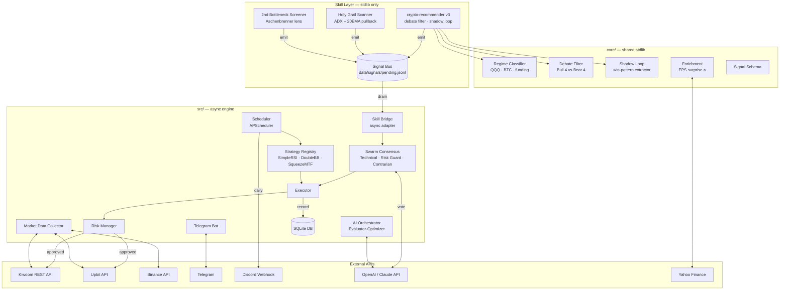
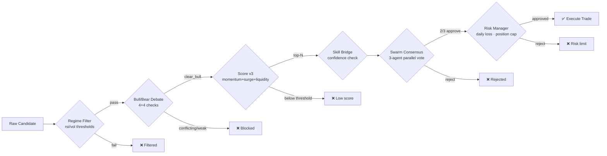
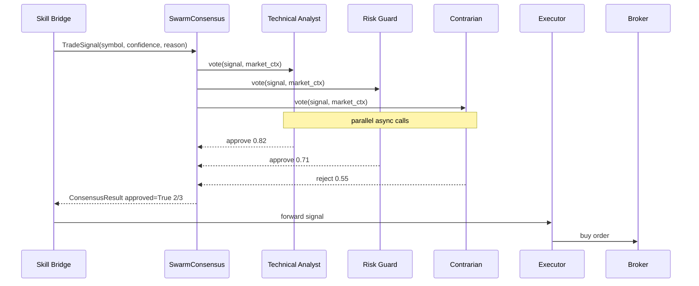
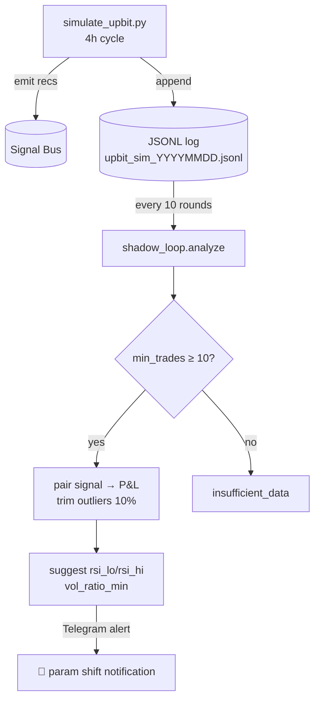
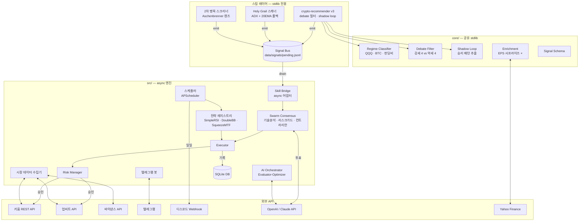
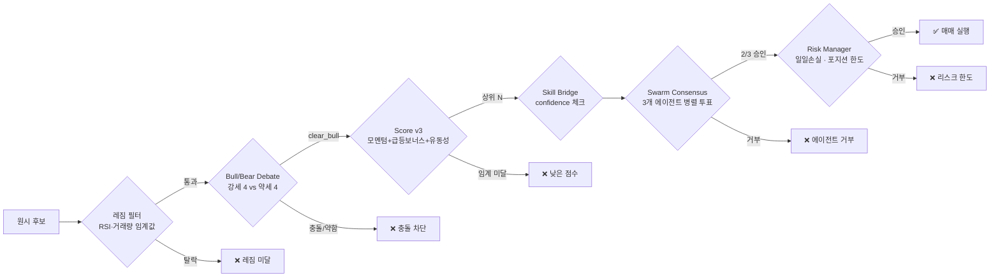
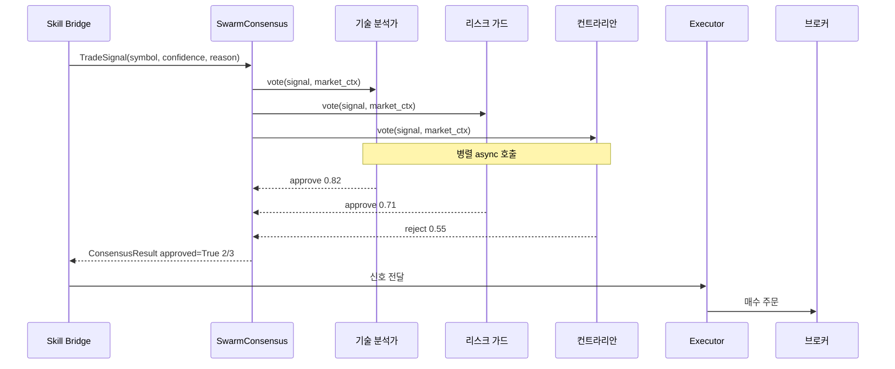
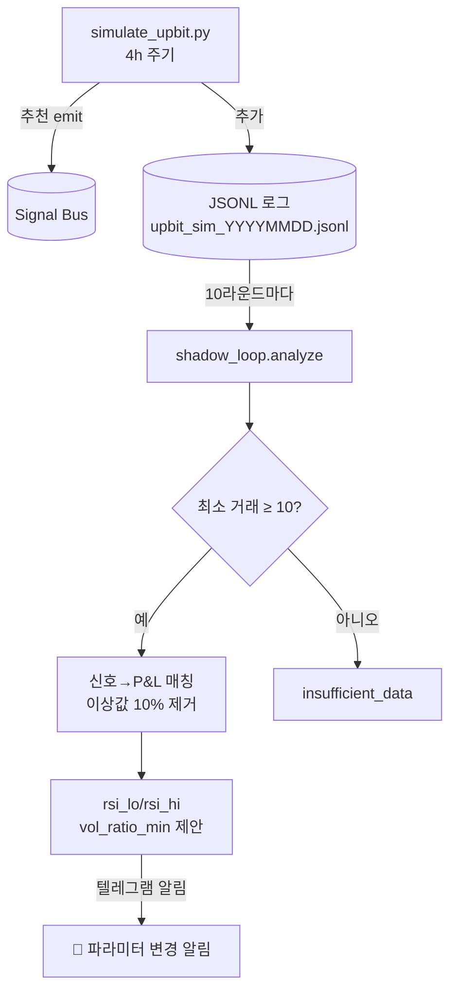

# Trading System

> **한국어 문서는 [아래 Korean section](#korean-readme-한국어)을 참고하세요.**

An automated, multi-layer trading system for Korean markets — KRX stocks via Kiwoom Securities REST API and crypto via Upbit — augmented with a multi-agent AI signal validation pipeline, regime-aware parameter tuning, and a self-improving shadow account loop.

---

## Why This Over a Simple Bot (OpenClaw Comparison)

| Capability | Naive signal bot (OpenClaw style) | This system |
|---|---|---|
| Signal generation | Single RSI/momentum check | Multi-layer: Debate → Swarm → Risk Manager |
| Market regime | Static RSI thresholds | NASDAQ + BTC + funding rate → risk\_on / neutral / risk\_off |
| Signal conflict detection | None | Bull/Bear Debate: blocks when both sides score ≥ 2/4 simultaneously |
| AI validation | Single LLM call (or none) | 3 parallel agents (Technical / Risk Guard / Contrarian), 2/3 quorum |
| Learning loop | None | Shadow Account Loop: extracts winning patterns from simulation logs |
| Skill isolation | Monolithic script | File-based Signal Bus — stdlib skills never import async src/ code |
| Backtesting rigour | Basic win-rate | Monte Carlo p-value + walk-forward window validation |
| Multi-market | Single exchange | Upbit (crypto) + Kiwoom (KRX) + Binance (futures / spot) |
| Skills | Hardcoded logic | Pluggable: crypto-recommender · Holy Grail · Aschenbrenner 2nd Bottleneck |
| Earnings enrichment | None | Yahoo Finance EPS surprise multiplier (±15–30% score adjustment) |

---

## Features

- **Multi-broker** — Kiwoom Securities REST API (KRX stocks) + Upbit (crypto)
- **3 built-in strategies** — SimpleRSI, Double Bollinger Band Short, Squeeze MTF
- **Regime-aware parameters** — QQQ + BTC + perpetual funding rate → `risk_on / neutral / risk_off` dynamically adjusts RSI and volume thresholds
- **Bull/Bear Debate filter** — rule-based conflict detector; blocks signals when bullish and bearish evidence both score ≥ 2/4
- **Swarm Consensus** — 3 AI agents vote in parallel (Technical Analyst · Risk Guard · Contrarian), 2/3 quorum required
- **Shadow Account Loop** — analyses JSONL simulation logs to extract winning RSI/vol\_ratio patterns and suggests parameter adjustments
- **Signal Bus** — file-based IPC (`data/signals/pending.jsonl`) decoupling stdlib skills from the async engine
- **Skill Bridge** — async adapter routing skill signals through SwarmConsensus before execution
- **Statistical backtesting** — Monte Carlo p-value + walk-forward validation per strategy
- **Earnings enrichment** — EPS surprise lookup (Yahoo Finance) boosts/penalises stock signals
- **3 pluggable skills** — crypto-recommender v3, Holy Grail (Street Smarts ADX), Aschenbrenner 2nd Bottleneck screener
- **Risk management** — daily loss cap, per-position size cap, dry\_run mode
- **Notifications** — Telegram bot (commands + trade alerts) + Discord daily report
- **Docker-first** — single `docker compose up` deployment

---

## Architecture

### System Overview


```mermaid
graph TB
    subgraph External["External APIs"]
        KW[Kiwoom REST API]
        UB[Upbit API]
        BN[Binance API]
        TG[Telegram]
        DC[Discord Webhook]
        AI[OpenAI / Claude API]
        YF[Yahoo Finance]
    end

    subgraph Skills["Skill Layer — stdlib only"]
        CR[crypto-recommender v3<br/>debate filter · shadow loop]
        HG[Holy Grail Scanner<br/>ADX + 20EMA pullback]
        SP[2nd Bottleneck Screener<br/>Aschenbrenner lens]
        BUS[(Signal Bus<br/>data/signals/pending.jsonl)]
    end

    subgraph Core["core/ — shared stdlib"]
        RC[Regime Classifier<br/>QQQ · BTC · funding]
        DB[Debate Filter<br/>Bull 4 vs Bear 4]
        SL[Shadow Loop<br/>win-pattern extractor]
        ENR[Enrichment<br/>EPS surprise ×]
        SC[Signal Schema]
    end

    subgraph Engine["src/ — async engine"]
        BOT[Telegram Bot]
        SCH[Scheduler<br/>APScheduler]
        STR[Strategy Registry<br/>SimpleRSI · DoubleBB · SqueezeMTF]
        SW[Swarm Consensus<br/>Technical · Risk Guard · Contrarian]
        SB[Skill Bridge<br/>async adapter]
        EXE[Executor]
        RM[Risk Manager]
        AGT[AI Orchestrator<br/>Evaluator-Optimizer]
        COL[Market Data Collector]
        DB2[(SQLite DB)]
    end

    CR -->|emit| BUS
    HG -->|emit| BUS
    SP -->|emit| BUS
    CR --> RC
    CR --> DB
    CR --> SL
    BUS -->|drain| SB
    SB --> SW
    SW <-->|vote| AI
    SW --> EXE
    SCH --> STR
    STR --> EXE
    EXE --> RM
    RM -->|approved| KW
    RM -->|approved| UB
    EXE -->|record| DB2
    COL <--> KW
    COL <--> UB
    COL <--> BN
    ENR <--> YF
    BOT <--> TG
    SCH -->|daily| DC
    AGT <--> AI
```

### Signal Validation Pipeline


```mermaid
flowchart LR
    A[Raw Candidate] --> B{Regime Filter\nrsi/vol thresholds}
    B -- pass --> C{Bull/Bear Debate\n4+4 checks}
    B -- fail --> X1[❌ Filtered]
    C -- clear_bull --> D{Score v3\nmomentum+surge+liquidity}
    C -- conflicting/weak --> X2[❌ Blocked]
    D -- top-N --> E{Skill Bridge\nconfidence check}
    D -- below threshold --> X3[❌ Low score]
    E --> F{Swarm Consensus\n3-agent parallel vote}
    F -- 2/3 approve --> G{Risk Manager\ndaily loss · position cap}
    F -- reject --> X4[❌ Rejected]
    G -- approved --> H[✅ Execute Trade]
    G -- reject --> X5[❌ Risk limit]
```

### Swarm Consensus Flow


```mermaid
sequenceDiagram
    participant SB as Skill Bridge
    participant SW as SwarmConsensus
    participant T as Technical Analyst
    participant RG as Risk Guard
    participant C as Contrarian
    participant EX as Executor
    participant BR as Broker

    SB->>SW: TradeSignal(symbol, confidence, reason)
    SW->>T: vote(signal, market_ctx)
    SW->>RG: vote(signal, market_ctx)
    SW->>C: vote(signal, market_ctx)
    Note over T,C: parallel async calls
    T-->>SW: approve 0.82
    RG-->>SW: approve 0.71
    C-->>SW: reject 0.55
    SW-->>SB: ConsensusResult approved=True 2/3
    SB->>EX: forward signal
    EX->>BR: buy order
```

### Shadow Account Learning Loop


```mermaid
flowchart TD
    A[simulate_upbit.py\n4h cycle] -->|emit recs| B[(Signal Bus)]
    A -->|append| C[(JSONL log\nupbit_sim_YYYYMMDD.jsonl)]
    C -->|every 10 rounds| D[shadow_loop.analyze]
    D --> E{min_trades ≥ 10?}
    E -- yes --> F[pair signal → P&L\ntrim outliers 10%]
    F --> G[suggest rsi_lo/rsi_hi\nvol_ratio_min]
    G -->|Telegram alert| H[📱 param shift notification]
    E -- no --> I[insufficient_data]
```

---

## Directory Layout

```
core/                              # Stdlib-only, zero circular deps
├── backtest_core.py               # Monte Carlo p-value, walk-forward, summary metrics
├── debate.py                      # Bull/Bear conflict filter (rule-based 4+4)
├── enrichment.py                  # Yahoo Finance EPS surprise multiplier
├── regime_classifier.py           # QQQ + BTC + funding → risk_on|neutral|risk_off
├── reporter.py                    # Telegram send + Obsidian note updater
├── shadow_loop.py                 # Winning pattern extractor from simulation JSONL
├── signal_bus.py                  # File-based IPC (pending / processed / rejected)
└── signal_schema.py               # core.Signal dataclass

src/
├── agents/
│   ├── backend.py                 # AgentBackend ABC
│   ├── claude_backend.py          # Anthropic backend
│   ├── openai_backend.py          # OpenAI backend
│   ├── orchestrator.py            # Evaluator-Optimizer loop
│   ├── sandbox.py                 # Code execution sandbox
│   ├── swarm.py                   # SwarmConsensus (3-agent, 2/3 quorum)
│   ├── models.py                  # AgentContext, ConsensusResult, SignalVote
│   └── prompts/                   # technical.md, risk_guard.md, contrarian.md
├── brokers/                       # BrokerAdapter (Kiwoom, Upbit)
├── data/                          # Market data collector + SQLite cache
├── db/                            # Schema + repositories
├── engine/
│   ├── executor.py                # Strategy run → risk check → order
│   ├── risk_manager.py            # Daily loss cap + position size cap
│   ├── scheduler.py               # APScheduler-based trigger
│   ├── backtest.py                # Per-strategy backtest runner
│   ├── hunting.py                 # Opportunity hunter
│   └── skill_bridge.py           # signal_bus drain → SwarmConsensus → Executor
├── strategies/                    # SimpleRSI, DoubleBBShort, SqueezeMTF
├── telegram/                      # Bot + command handlers
└── utils/                         # RSI, BB, Squeeze indicators

skills/
├── crypto-recommender/            # Binance futures/spot + Upbit scalping
│   └── scripts/
│       ├── recommend.py           # Score v3 + debate filter (all 3 exchanges)
│       └── simulate_upbit.py      # 4h sim loop + signal_bus emit + shadow loop
├── holy-grail/                    # Street Smarts ADX+20EMA pullback (scan/check/watch)
│   └── scripts/scanner.py
└── second-play/                   # Aschenbrenner 2nd bottleneck screener
    └── scripts/screen.py          # trends / discover / screen modes

docs/
└── server-deploy-guide.md         # Ubuntu + Docker deployment guide
```

**Dependency rule**: `src/` → `core/` ← `skills/`. Neither `core/` nor `skills/` import from `src/`. No circular dependencies.

---

## Strategies

| Strategy | Broker | Timeframe | Logic |
|---|---|---|---|
| **SimpleRSI** | Upbit | 5m | RSI < 30 → buy · RSI > 70 → sell |
| **DoubleBBShort** | Upbit | 15m | Price breaks outer BB (2σ) + RSI oversold → reversal entry |
| **SqueezeMTF** | Upbit | 5m | BB inside KC (squeeze on) → momentum explodes → multi-timeframe confirmed entry |

---

## Skills

### crypto-recommender v3
Scalping signal generator across Binance Futures, Binance Spot, and Upbit. Each candidate passes four layers before reaching the top-3 list:

1. **Pre-filter** — 24h momentum + minimum USDT volume
2. **Score v3** — `momentum × 0.65 + surge_bonus + liquidity + rsi_room`
3. **Debate filter** — `debate(ch_1h, rsi, vol_ratio, ch_15m)` classifies `clear_bull / conflicting / clear_bear / weak`; conflicting/weak are deprioritised
4. **Regime-aware thresholds** — RSI range and vol\_ratio minimum shift with current market regime

Every recommendation is emitted to the Signal Bus. Every 10 simulation rounds the Shadow Loop analyses accumulated P&L and surfaces parameter adjustment suggestions.

### Holy Grail Scanner (Street Smarts Ch. 10)
ADX(14) > 30 and rising + price pulls back to 20-EMA → **buy stop entry above prior bar high**.

```bash
python3 skills/holy-grail/scripts/scanner.py scan          # full universe
python3 skills/holy-grail/scripts/scanner.py check --symbol QQQ
python3 skills/holy-grail/scripts/scanner.py watch         # repeat every 5m
```

### Aschenbrenner 2nd Bottleneck Screener
*"The real bottleneck for AI is electricity"* — screens US stocks through the Aschenbrenner lens across 10 sub-themes (nuclear, gas, power grid, data center REITs, cooling, optical, copper, BTC-to-AI miners).

```bash
python3 skills/second-play/scripts/screen.py trends        # top momentum sub-themes
python3 skills/second-play/scripts/screen.py discover --trend nuclear
python3 skills/second-play/scripts/screen.py screen --category power
```

---

## Quick Start

```bash
# Docker (recommended)
cp .env.example .env   # fill in credentials
docker compose up -d
docker compose logs -f

# Local
python -m venv .venv && source .venv/bin/activate
pip install -e ".[dev]"
cp .env.example .env
python -m src.main
```

---

## Configuration

```env
# Upbit
UPBIT_ACCESS_KEY=
UPBIT_SECRET_KEY=

# Kiwoom Securities REST API
KIWOOM_APP_KEY=
KIWOOM_APP_SECRET=
KIWOOM_ACCOUNT_NO=
KIWOOM_IS_PAPER=true

# Telegram
TELEGRAM_BOT_TOKEN=
TELEGRAM_CHAT_ID=

# Discord (optional)
DISCORD_WEBHOOK_URL=

# AI (at least one)
ANTHROPIC_API_KEY=
OPENAI_API_KEY=

# DB
DB_PATH=data/trading.db

# Feature flags
DRY_RUN=false
SWARM_ENABLED=false       # enable 3-agent consensus gate
SIGNAL_BUS_DIR=data/signals
SHADOW_INTERVAL=10        # shadow loop every N simulation rounds
```

| Service | Where to get |
|---|---|
| Upbit | [Upbit Open API](https://upbit.com/service_center/open_api_guide) |
| Kiwoom | [api.kiwoom.com](https://apiportal.kiwoom.com) → Register app |
| Telegram | @BotFather → `/newbot`; chat ID via @userinfobot |
| Discord | Server settings → Integrations → Webhooks |
| Anthropic | [console.anthropic.com](https://console.anthropic.com) |
| OpenAI | [platform.openai.com](https://platform.openai.com) |

---

## Backtesting

```bash
# Per-strategy backtest
python -m src.engine.backtest --strategy simple_rsi --days 90

# crypto-recommender backtest
python skills/crypto-recommender/scripts/recommend.py --exchange upbit --market spot
```

Metrics reported: win rate, avg return %, Sharpe ratio, max drawdown, total return, Monte Carlo p-value, walk-forward window consistency.

---

## Secrets Management

> Never commit `.env`. It is in `.gitignore`.

| Variable | Risk if leaked |
|---|---|
| `UPBIT_ACCESS_KEY/SECRET_KEY` | Unauthorized trades, fund withdrawal |
| `KIWOOM_APP_KEY/SECRET` | Unauthorized stock orders |
| `TELEGRAM_BOT_TOKEN` | Bot hijacking |
| `ANTHROPIC_API_KEY/OPENAI_API_KEY` | Unlimited API billing |

- Rotate Upbit keys every 90 days (platform enforces expiry)
- Use `KIWOOM_IS_PAPER=true` until strategy is validated live
- Disable Upbit withdrawal permission in the API settings

---

## CI/CD

GitHub Actions builds and pushes to GHCR on every `main` push:

```
ghcr.io/bongho/trading-system-public:main
ghcr.io/bongho/trading-system-public:sha-<commit>
```

```bash
docker pull ghcr.io/bongho/trading-system-public:main
```

---

## Testing

```bash
pytest -v
pytest --cov=src --cov-report=term-missing
```

---

## Roadmap

| Phase | Feature | Status |
|---|---|---|
| 1 | Upbit broker + basic strategy engine | ✅ Done |
| 2 | SimpleRSI + backtesting | ✅ Done |
| 3 | Discord daily report + Telegram bot | ✅ Done |
| 4 | DoubleBB & SqueezeMTF + Kiwoom REST API | ✅ Done |
| 5 | AI Agent (Evaluator-Optimizer loop) | ✅ Done |
| 6 | Swarm Consensus — 3-agent signal voting | ✅ Done |
| **7** | **Skill layer loose coupling** — debate filter · shadow loop · signal bus · skill bridge | ✅ **Done** |
| 8 | PSO parameter auto-optimisation (weekly) | 🔜 Planned |
| 9 | Adaptive strategy capital allocation | 🔜 Planned |

---

## License

MIT

---
---

# Korean README (한국어)

# 트레이딩 시스템

한국 시장(키움증권 REST API를 통한 KRX 주식 + 업비트 암호화폐) 대상 자동 매매 시스템입니다. 다중 에이전트 AI 신호 검증 파이프라인, 시장 레짐 인식 파라미터 조정, 자기학습 Shadow Account Loop를 탑재하고 있습니다.

---

## 단순 봇 대비 차별점 (OpenClaw 비교)

| 항목 | 단순 신호 봇 (OpenClaw 방식) | 이 시스템 |
|---|---|---|
| 신호 생성 | RSI/모멘텀 단순 체크 | 다중 레이어: Debate → Swarm → Risk Manager |
| 시장 레짐 | 고정 RSI 임계값 | NASDAQ + BTC + 펀딩비 → risk\_on / neutral / risk\_off |
| 신호 충돌 감지 | 없음 | Bull/Bear Debate: 양측 모두 ≥ 2/4 점수 시 차단 |
| AI 검증 | 단일 LLM 호출(또는 없음) | 3개 에이전트 병렬 투표 (기술 분석 / 리스크 가드 / 컨트라리안), 2/3 정족수 |
| 학습 루프 | 없음 | Shadow Account Loop: 시뮬레이션 로그에서 승리 패턴 자동 추출 |
| 스킬 격리 | 단일 모놀리식 스크립트 | 파일 기반 Signal Bus — stdlib 스킬이 async src/ 코드를 절대 임포트하지 않음 |
| 백테스트 엄밀성 | 단순 승률 | 몬테카를로 p-value + 워크포워드 윈도우 검증 |
| 다중 거래소 | 단일 거래소 | 업비트(암호화폐) + 키움(KRX) + 바이낸스(선물/현물) |
| 스킬 | 하드코딩 로직 | 플러그인 방식: crypto-recommender · Holy Grail · Aschenbrenner 2차 병목 |
| 수익 보강 | 없음 | Yahoo Finance EPS 서프라이즈 배수 (점수 ±15~30% 조정) |

---

## 전체 기능

- **멀티 브로커** — 키움증권 REST API (KRX 주식) + 업비트 (암호화폐)
- **내장 전략 3종** — SimpleRSI, Double Bollinger Band Short, Squeeze MTF
- **레짐 인식 파라미터** — QQQ + BTC + 영구 선물 펀딩비 → `risk_on / neutral / risk_off`로 RSI·거래량 임계값 동적 조정
- **Bull/Bear Debate 필터** — 규칙 기반 충돌 감지기; 강세·약세 증거가 동시에 ≥ 2/4 점이면 신호 차단
- **Swarm Consensus** — 3개 AI 에이전트 병렬 투표 (기술 분석 · 리스크 가드 · 컨트라리안), 2/3 정족수 필요
- **Shadow Account Loop** — JSONL 시뮬레이션 로그를 분석해 승리 RSI/vol\_ratio 패턴을 추출하고 파라미터 조정 제안
- **Signal Bus** — 파일 기반 IPC (`data/signals/pending.jsonl`), stdlib 스킬과 async 엔진 완전 디커플링
- **Skill Bridge** — 스킬 신호를 SwarmConsensus를 거쳐 Executor로 라우팅하는 async 어댑터
- **통계적 백테스트** — 전략별 몬테카를로 p-value + 워크포워드 검증
- **수익 보강** — EPS 서프라이즈 조회(Yahoo Finance)로 주식 신호 가중치 조정
- **플러그인 스킬 3종** — crypto-recommender v3, Holy Grail (Street Smarts ADX), Aschenbrenner 2차 병목 스크리너
- **리스크 관리** — 일일 손실 한도, 포지션 크기 한도, dry\_run 모드
- **알림** — 텔레그램 봇 (명령어 + 거래 알림) + 디스코드 일일 리포트
- **Docker 우선** — `docker compose up` 단일 명령으로 배포

---

## 아키텍처

### 시스템 전체 구조


```mermaid
graph TB
    subgraph External["외부 API"]
        KW[키움 REST API]
        UB[업비트 API]
        BN[바이낸스 API]
        TG[텔레그램]
        DC[디스코드 Webhook]
        AI[OpenAI / Claude API]
        YF[Yahoo Finance]
    end

    subgraph Skills["스킬 레이어 — stdlib 전용"]
        CR[crypto-recommender v3<br/>debate 필터 · shadow loop]
        HG[Holy Grail 스캐너<br/>ADX + 20EMA 풀백]
        SP[2차 병목 스크리너<br/>Aschenbrenner 렌즈]
        BUS[(Signal Bus<br/>data/signals/pending.jsonl)]
    end

    subgraph CoreLib["core/ — 공유 stdlib"]
        RC[Regime Classifier<br/>QQQ · BTC · 펀딩비]
        DB[Debate Filter<br/>강세 4 vs 약세 4]
        SL[Shadow Loop<br/>승리 패턴 추출]
        ENR[Enrichment<br/>EPS 서프라이즈 ×]
        SC[Signal Schema]
    end

    subgraph Engine["src/ — async 엔진"]
        BOT[텔레그램 봇]
        SCH[스케줄러<br/>APScheduler]
        STR[전략 레지스트리<br/>SimpleRSI · DoubleBB · SqueezeMTF]
        SW[Swarm Consensus<br/>기술분석 · 리스크가드 · 컨트라리안]
        SB[Skill Bridge<br/>async 어댑터]
        EXE[Executor]
        RM[Risk Manager]
        AGT[AI Orchestrator<br/>Evaluator-Optimizer]
        COL[시장 데이터 수집기]
        DB2[(SQLite DB)]
    end

    CR -->|emit| BUS
    HG -->|emit| BUS
    SP -->|emit| BUS
    CR --> RC
    CR --> DB
    CR --> SL
    BUS -->|drain| SB
    SB --> SW
    SW <-->|투표| AI
    SW --> EXE
    SCH --> STR
    STR --> EXE
    EXE --> RM
    RM -->|승인| KW
    RM -->|승인| UB
    EXE -->|기록| DB2
    COL <--> KW
    COL <--> UB
    COL <--> BN
    ENR <--> YF
    BOT <--> TG
    SCH -->|일일| DC
    AGT <--> AI
```

### 신호 검증 파이프라인


```mermaid
flowchart LR
    A[원시 후보] --> B{레짐 필터\nRSI·거래량 임계값}
    B -- 통과 --> C{Bull/Bear Debate\n강세 4 vs 약세 4}
    B -- 탈락 --> X1[❌ 레짐 미달]
    C -- clear_bull --> D{Score v3\n모멘텀+급등보너스+유동성}
    C -- 충돌/약함 --> X2[❌ 충돌 차단]
    D -- 상위 N --> E{Skill Bridge\nconfidence 체크}
    D -- 임계 미달 --> X3[❌ 낮은 점수]
    E --> F{Swarm Consensus\n3개 에이전트 병렬 투표}
    F -- 2/3 승인 --> G{Risk Manager\n일일손실 · 포지션 한도}
    F -- 거부 --> X4[❌ 에이전트 거부]
    G -- 승인 --> H[✅ 매매 실행]
    G -- 거부 --> X5[❌ 리스크 한도]
```

### Swarm Consensus 흐름


```mermaid
sequenceDiagram
    participant SB as Skill Bridge
    participant SW as SwarmConsensus
    participant T as 기술 분석가
    participant RG as 리스크 가드
    participant C as 컨트라리안
    participant EX as Executor
    participant BR as 브로커

    SB->>SW: TradeSignal(symbol, confidence, reason)
    SW->>T: vote(signal, market_ctx)
    SW->>RG: vote(signal, market_ctx)
    SW->>C: vote(signal, market_ctx)
    Note over T,C: 병렬 async 호출
    T-->>SW: approve 0.82
    RG-->>SW: approve 0.71
    C-->>SW: reject 0.55
    SW-->>SB: ConsensusResult approved=True 2/3
    SB->>EX: 신호 전달
    EX->>BR: 매수 주문
```

### Shadow Account 학습 루프


```mermaid
flowchart TD
    A[simulate_upbit.py\n4h 주기] -->|추천 emit| B[(Signal Bus)]
    A -->|추가| C[(JSONL 로그\nupbit_sim_YYYYMMDD.jsonl)]
    C -->|10라운드마다| D[shadow_loop.analyze]
    D --> E{최소 거래 ≥ 10?}
    E -- 예 --> F[신호→P&L 매칭\n이상값 10% 제거]
    F --> G[rsi_lo/rsi_hi\nvol_ratio_min 제안]
    G -->|텔레그램 알림| H[📱 파라미터 변경 알림]
    E -- 아니오 --> I[insufficient_data]
```

---

## 디렉토리 구조

```
core/                              # stdlib 전용, 순환 의존성 없음
├── backtest_core.py               # 몬테카를로 p-value, 워크포워드, 성과 지표
├── debate.py                      # Bull/Bear 충돌 필터 (규칙 기반 4+4)
├── enrichment.py                  # Yahoo Finance EPS 서프라이즈 배수
├── regime_classifier.py           # QQQ + BTC + 펀딩비 → risk_on|neutral|risk_off
├── reporter.py                    # 텔레그램 전송 + Obsidian 노트 업데이트
├── shadow_loop.py                 # 시뮬레이션 JSONL에서 승리 패턴 추출
├── signal_bus.py                  # 파일 기반 IPC (pending / processed / rejected)
└── signal_schema.py               # core.Signal 데이터클래스

src/
├── agents/
│   ├── backend.py                 # AgentBackend ABC
│   ├── claude_backend.py          # Anthropic 백엔드
│   ├── openai_backend.py          # OpenAI 백엔드
│   ├── orchestrator.py            # Evaluator-Optimizer 루프
│   ├── sandbox.py                 # 코드 실행 샌드박스
│   ├── swarm.py                   # SwarmConsensus (3 에이전트, 2/3 정족수)
│   ├── models.py                  # AgentContext, ConsensusResult, SignalVote
│   └── prompts/                   # technical.md, risk_guard.md, contrarian.md
├── brokers/                       # BrokerAdapter (키움, 업비트)
├── data/                          # 시장 데이터 수집기 + SQLite 캐시
├── db/                            # 스키마 + 레포지토리
├── engine/
│   ├── executor.py                # 전략 실행 → 리스크 체크 → 주문
│   ├── risk_manager.py            # 일일 손실 한도 + 포지션 크기 한도
│   ├── scheduler.py               # APScheduler 기반 트리거
│   ├── backtest.py                # 전략별 백테스트 러너
│   ├── hunting.py                 # 기회 탐색기
│   └── skill_bridge.py           # signal_bus 드레인 → SwarmConsensus → Executor
├── strategies/                    # SimpleRSI, DoubleBBShort, SqueezeMTF
├── telegram/                      # 봇 + 커맨드 핸들러
└── utils/                         # RSI, BB, Squeeze 지표

skills/
├── crypto-recommender/            # 바이낸스 선물/현물 + 업비트 스캘핑
│   └── scripts/
│       ├── recommend.py           # Score v3 + debate 필터 (3개 거래소)
│       └── simulate_upbit.py      # 4h 시뮬 루프 + signal_bus emit + shadow loop
├── holy-grail/                    # Street Smarts ADX+20EMA 풀백 (scan/check/watch)
│   └── scripts/scanner.py
└── second-play/                   # Aschenbrenner 2차 병목 스크리너
    └── scripts/screen.py          # trends / discover / screen 모드

docs/
└── server-deploy-guide.md         # Ubuntu + Docker 배포 가이드
```

**의존성 규칙**: `src/` → `core/` ← `skills/`. `core/`와 `skills/`는 `src/`를 임포트하지 않습니다 — 순환 의존성 없음.

---

## 전략

| 전략 | 브로커 | 타임프레임 | 로직 |
|---|---|---|---|
| **SimpleRSI** | 업비트 | 5분 | RSI < 30 → 매수 · RSI > 70 → 매도 |
| **DoubleBBShort** | 업비트 | 15분 | 가격이 외부 BB(2σ) 돌파 + RSI 과매도 → 반전 진입 |
| **SqueezeMTF** | 업비트 | 5분 | BB가 KC 내부(스퀴즈 ON) → 모멘텀 폭발 → 멀티타임프레임 확인 진입 |

---

## 스킬

### crypto-recommender v3
바이낸스 선물, 바이낸스 현물, 업비트 대상 스캘핑 신호 생성기. 각 후보는 4개 레이어를 통과해야 상위 3개 목록에 오릅니다:

1. **사전 필터** — 24h 모멘텀 + 최소 USDT 거래량
2. **Score v3** — `모멘텀 × 0.65 + 급등보너스 + 유동성 + RSI 여유`
3. **Debate 필터** — `debate(ch_1h, rsi, vol_ratio, ch_15m)`로 `clear_bull / conflicting / clear_bear / weak` 분류; conflicting/weak 신호는 후순위
4. **레짐 인식 임계값** — 현재 시장 레짐에 따라 RSI 범위·vol\_ratio 최솟값 동적 조정

모든 추천 종목은 Signal Bus로 emit됩니다. 10라운드마다 Shadow Loop가 누적 P&L을 분석하고 파라미터 조정을 제안합니다.

### Holy Grail 스캐너 (Street Smarts 10장)
ADX(14) > 30 이면서 상승 + 가격이 20EMA로 풀백 → **직전 고가 위에 buy stop 진입**.

```bash
python3 skills/holy-grail/scripts/scanner.py scan          # 전체 유니버스
python3 skills/holy-grail/scripts/scanner.py check --symbol QQQ
python3 skills/holy-grail/scripts/scanner.py watch         # 5분마다 반복
```

### Aschenbrenner 2차 병목 스크리너
*"AI의 진짜 병목은 전기다"* — 10개 세부 테마(원자력, 천연가스, 전력망, 데이터센터 REIT, 냉각, 광통신, 구리, BTC→AI 채굴)에 걸쳐 미국 주식을 스크리닝합니다.

```bash
python3 skills/second-play/scripts/screen.py trends                    # 상위 모멘텀 테마
python3 skills/second-play/scripts/screen.py discover --trend nuclear
python3 skills/second-play/scripts/screen.py screen --category power
```

---

## 빠른 시작

```bash
# Docker (권장)
cp .env.example .env   # 인증 정보 입력
docker compose up -d
docker compose logs -f

# 로컬 실행
python -m venv .venv && source .venv/bin/activate
pip install -e ".[dev]"
cp .env.example .env
python -m src.main
```

---

## 환경 변수 설정

```env
# 업비트
UPBIT_ACCESS_KEY=
UPBIT_SECRET_KEY=

# 키움증권 REST API
KIWOOM_APP_KEY=
KIWOOM_APP_SECRET=
KIWOOM_ACCOUNT_NO=
KIWOOM_IS_PAPER=true     # 모의투자: true / 실전: false

# 텔레그램
TELEGRAM_BOT_TOKEN=
TELEGRAM_CHAT_ID=

# 디스코드 (선택)
DISCORD_WEBHOOK_URL=

# AI (최소 1개)
ANTHROPIC_API_KEY=
OPENAI_API_KEY=

# DB
DB_PATH=data/trading.db

# 기능 플래그
DRY_RUN=false
SWARM_ENABLED=false        # 3-에이전트 합의 게이트 활성화
SIGNAL_BUS_DIR=data/signals
SHADOW_INTERVAL=10         # N 라운드마다 shadow loop 실행
```

---

## 백테스트

```bash
# 전략별 백테스트
python -m src.engine.backtest --strategy simple_rsi --days 90

# crypto-recommender 백테스트
python skills/crypto-recommender/scripts/recommend.py --exchange upbit --market spot
```

보고 지표: 승률, 평균 수익률, 샤프 비율, 최대 낙폭, 총 수익률, 몬테카를로 p-value, 워크포워드 윈도우 일관성.

---

## 시크릿 관리

> `.env`는 절대 커밋하지 마세요. `.gitignore`에 포함되어 있습니다.

| 변수 | 유출 시 위험 |
|---|---|
| `UPBIT_ACCESS_KEY/SECRET_KEY` | 무단 거래, 출금 |
| `KIWOOM_APP_KEY/SECRET` | 무단 주식 주문 |
| `TELEGRAM_BOT_TOKEN` | 봇 하이재킹 |
| `ANTHROPIC_API_KEY/OPENAI_API_KEY` | 무제한 API 청구 |

- 업비트 API 키는 90일마다 교체 (플랫폼 만료 정책)
- 전략 검증 완료 전까지 `KIWOOM_IS_PAPER=true` 유지
- 업비트 API 설정에서 출금 권한 비활성화 권장

---

## 로드맵

| 단계 | 기능 | 상태 |
|---|---|---|
| 1 | 업비트 브로커 + 기본 전략 엔진 | ✅ 완료 |
| 2 | SimpleRSI + 백테스트 | ✅ 완료 |
| 3 | 디스코드 일일 리포트 + 텔레그램 봇 | ✅ 완료 |
| 4 | DoubleBB & SqueezeMTF + 키움 REST API | ✅ 완료 |
| 5 | AI 에이전트 (Evaluator-Optimizer 루프) | ✅ 완료 |
| 6 | Swarm Consensus — 3-에이전트 신호 투표 | ✅ 완료 |
| **7** | **스킬 레이어 느슨한 결합** — debate 필터 · shadow loop · signal bus · skill bridge | ✅ **완료** |
| 8 | PSO 파라미터 자동 최적화 (주간) | 🔜 예정 |
| 9 | 적응형 전략 자본 배분 | 🔜 예정 |

---

## 라이선스

MIT
